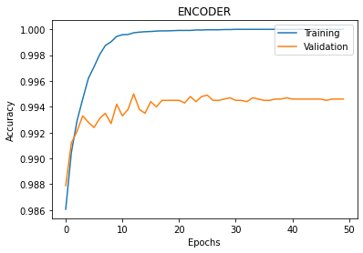
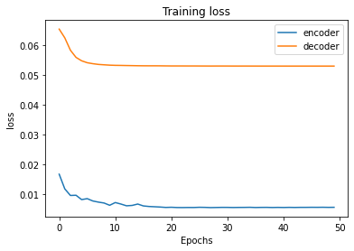
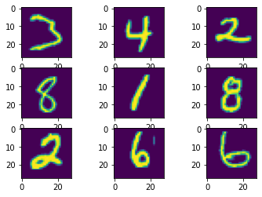
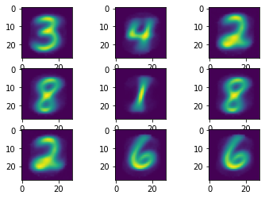

# Dynamic Routing Between Capsules
A Keras implementation of CapsNet in the paper:

[Sara Sabour, Nicholas Frosst, Geoffrey E Hinton. Dynamic Routing Between Capsules. NIPS 2017](https://arxiv.org/abs/1710.09829) 

This repository contains code to the section(4) which closely simulate those run by Geoffrey Hinton in the paper linked to above.
This project uses the capsule networks for identifying any given digit and the reconstruct its image.


**Differences with the paper:**   
1. We only report the test errors after `50 epochs` training. In the paper they trained for `1250 epochs` according to Figure A.1
2. We only experimented routing iteration 2 and 3 in our code but paper did on 2,3,5,7 and 10
3.  We use 0.0005xMSE as the reconstruction loss as 0.0005 is the coefficient for the loss. But decoder loss is calculated only as MSE.

## Warning

Please use Keras==2.2.4 with TensorFlow==1.15.0 backend, or the `K.batch_dot` function may not work correctly.

## Usage

**Step 1. Clone this repository to local.**
```
https://github.com/HB5101/CapsNet_Project.git
```
**Step 2.
Install Keras==2.2.4 with TensorFlow==1.15.0 backend.**
```
pip install tensorflow==1.15.0
pip install keras==2.2.4
```

**Step 3.
Train a CapsNet on MNIST**  

To access `idx3-ubyte` file as numpy array:
```
pip install idx2numpy
```

**Step 4. Test a pre-trained CapsNet model**

Suppose you have trained a model using the above command, then the trained model will be
saved to `result/trained_model.h5`.
The testing data is same as the validation data. It will be easy to test on new data, just change the code as you want.
%%%%%%%%%%%%%%%%%%%%%%%%%%%%%%%%%%%%%%%%%%%%%%%%%%

## Results

#### Test Errors   

CapsNet classification test error on MNIST.
Losses and accuracies on Test set only for routing iteration=3





#### Training Speed

About `285s / epoch` on Google Colab GPU for routing iteration=2.

About `448s / epoch` on Google Colab GPU for routing iteration=3.


#### Reconstruction result

Digits at left-side are real images from MNIST and digits at right-side are corresponding reconstructed images.




#### Conclusions from the experiment

1. With different number of routings we have different losses for initial epochs, but after a sufficient number of epochs losses         
converges to the same range.
2. While, training with routing iterations 2 and 3, we observed that with 2 routings, loss was initially high which drastically dropped just after few initial epochs, whereas when number of routings was increased to 3, model started with low loss which eventually decrease slowly. 
3. In general more routing iterations increases the network capacity and tends to overfit to the training dataset 

